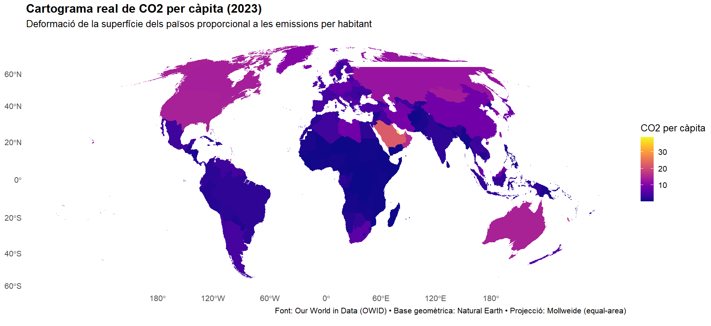
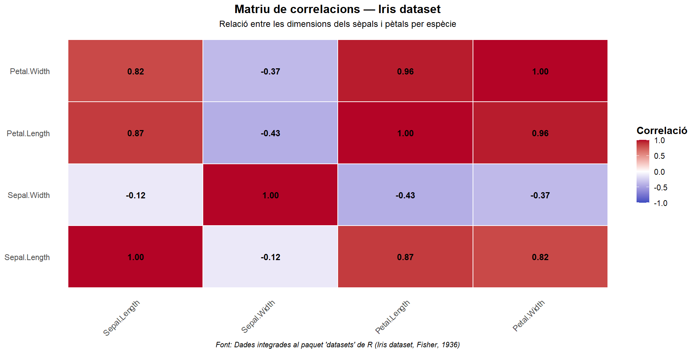
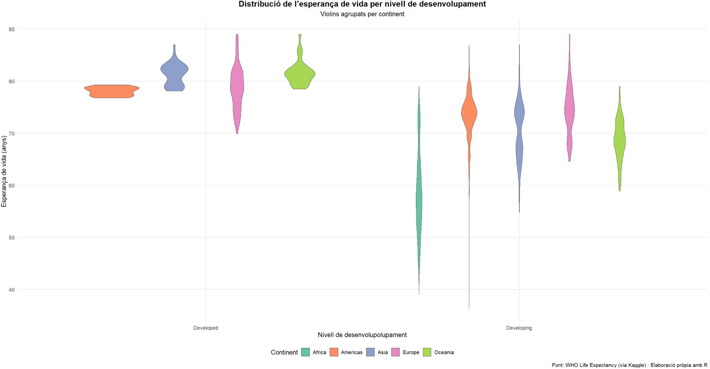

# Visualitzacions PAC2 — Ricard Vidal

## 🌍 Cartograma — CO₂ per càpita (2023)

**Dades:** Our World in Data (OWID) · **Eines:** R (`sf`, `cartogram`, `ggplot2`)  
**Descripció:** Cartograma continu que deforma la superfície dels països segons el CO₂ per càpita.

---

## 🔢 Matriu de correlacions — Iris

**Dades:** Iris (Fisher, 1936) · **Eines:** R (`ggplot2`, `reshape2`)  
**Descripció:** Mapa de calor de correlacions entre variables de sèpal i pètal.

---

## 🩺 Violin plot — Esperança de vida

**Dades:** WHO Life Expectancy (Kaggle) · **Eines:** R (`ggplot2`)  
**Descripció:** Distribució de l’esperança de vida per nivell de desenvolupament, agrupada per continent.

Ricard Vidal Girones - Universitat Oberta de Catalunya - Visualitzacions de dades
